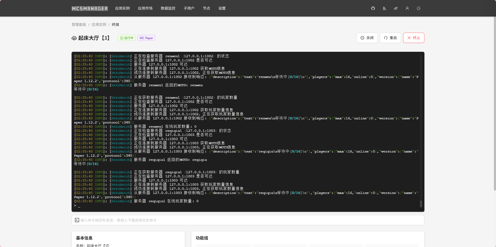
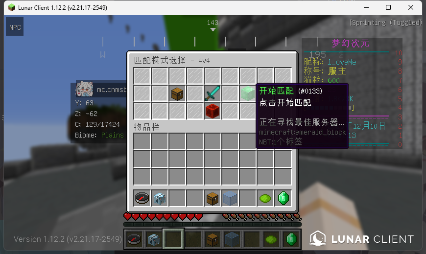

# NekoMatch 插件

NekoMatch 是一个Minecraft服务器匹配插件，用于管理多个游戏服务器并实现自动和手动匹配功能。

# 注意事项
对应匹配的服务器中motd必须包含以下内容
- 开发中
- 游戏中
- 等待中

示例：

必须使用`Redis`来缓存数据来减轻频繁发起TCP握手的压力。当然在小型服务器这算不上有压力。

这个插件会将匹配的服务器数据缓存在redis中。30秒后失效并且等待下一个玩家使用匹配后重新发起请求写入redis
## 功能特性

- **多模式匹配**：支持1v1、2v2、4v4等多种游戏模式
- **服务器状态检测**：通过MOTD检测服务器状态（开发中、游戏中、等待中）
- **自动匹配**：自动将玩家匹配到状态为"等待中"的服务器
- **手动加入**：玩家可以通过GUI手动选择服务器加入
- **状态显示**：在GUI中直观显示服务器状态和在线数量

## 配置说明

### config.yml

```yaml
# 服务器地址配置
servers:
  # 1v1 服务器
  vc-1v1-a:
    address: "127.0.0.1:25561"
  vc-1v1-b:
    address: "127.0.0.1:25562"
  
  # 2v2 服务器
  vc-2v2-a:
    address: "127.0.0.1:25563"
  vc-2v2-b:
    address: "127.0.0.1:25564"
  
  # 4v4 服务器
  ba1:
    address: "127.0.0.1:1000"
  vc-4v4-b:
    address: "127.0.0.1:25566"

# 游戏模式配置
modes:
  1v1:
    servers:
      - vc-1v1-a
      - vc-1v1-b
    description: "单人对战"
  2v2:
    servers:
      - vc-2v2-a
      - vc-2v2-b
    description: "双人对决"
  4v4:
    servers:
      - ba1
      - vc-4v4-b
    description: "四人团队战"
```

## 命令

- `/match [模式]` - 打开匹配GUI，默认为4v4模式
- `/matchreload` - 重新加载配置文件

## 使用方法

1. 使用 `/match` 命令打开匹配界面
2. 选择游戏模式
3. 点击"开始匹配"进行自动匹配，或点击"服务器信息"查看服务器状态并手动加入
4. 服务器状态通过不同颜色的羊毛显示：
   - 黄色：开发中
   - 红色：游戏中
   - 绿色：等待中
   - 灰色：离线

## 特殊规则

- 开发中状态的服务器禁止所有加入方式
- 游戏中状态的服务器禁止手动加入
- 自动匹配只选择"等待中"状态的服务器
- 每个游戏模式的服务器状态独立计算和显示

## 技术细节

- 使用Minecraft插件消息通道与代理服务器通信
- 通过Minecraft服务器状态查询协议获取服务器MOTD
- 支持Minecraft 1.8.x - 1.12.2协议版本